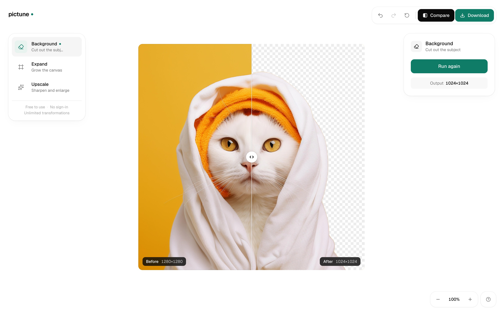
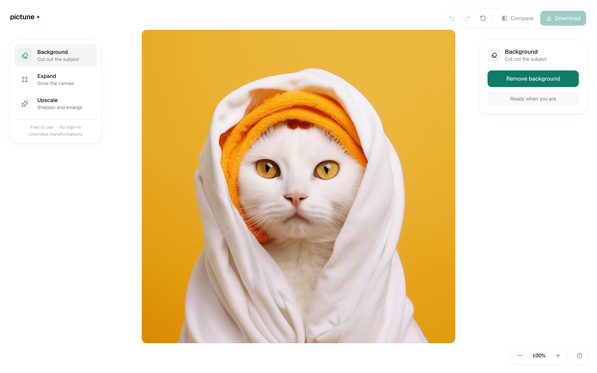
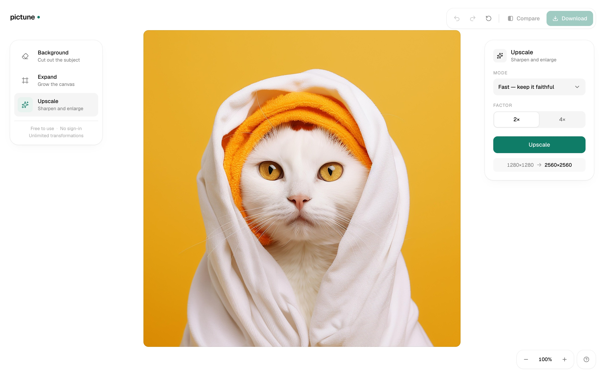
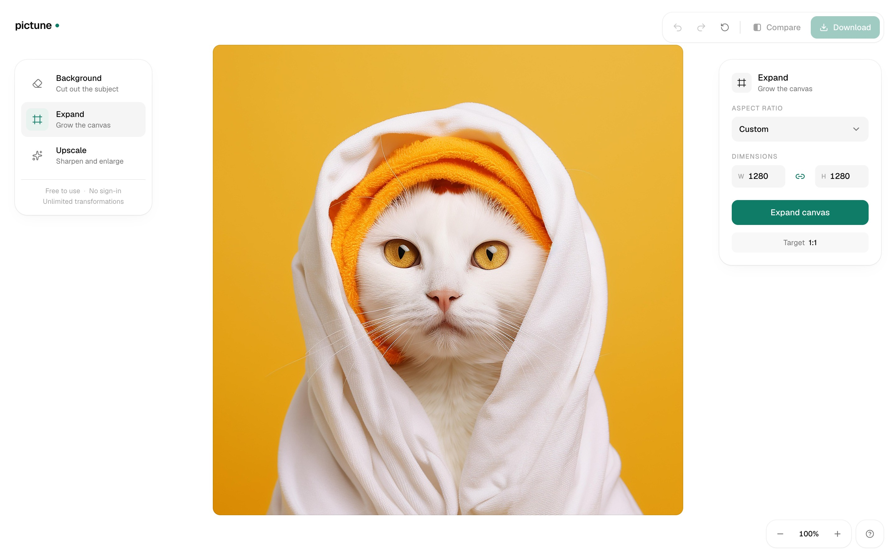
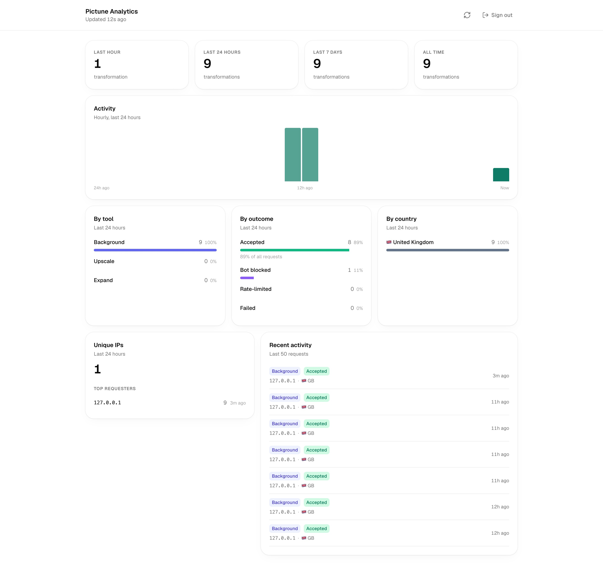

<div align="center">


# Pictune

### AI photo editing in your browser.

Three tools — background removal, upscaling, and expansion — served straight
from Cloudflare's edge. No signup, no watermarks, no upsells.

<br/>



</div>

<br/>

---

## Features

### Remove backgrounds

Drop a photo, click **Remove background**. A subject-aware model returns a
clean PNG with the background cut out — preserving fur, hair, and soft edges.



<details>
<summary>Details</summary>

<br/>

- Powered by `bria/remove-background` on Replicate
- Outputs 1024×1024 PNG with full alpha
- ~2–3 seconds per run
- `preserve_alpha: true` keeps soft edges crisp

</details>

<br/>

### Upscale 2× or 4×

Two profiles for two needs. **Fast** stays faithful to the original; **Quality**
adds plausible detail to recover over-smoothed features.



<details>
<summary>Details</summary>

<br/>

- Powered by `philz1337x/clarity-pro-upscaler`
- Fast = `creativity: 0` (no invention)
- Quality = `creativity: 4` (detail enhancement)
- 2× or 4× output from any input resolution

</details>

<br/>

### Expand the canvas

Outpaint your image to any aspect ratio. Link width and height for
proportional expansion, or unlock for custom dimensions.



<details>
<summary>Details</summary>

<br/>

- Powered by `bria/expand-image`
- Generates 1024×1024 at the target aspect with the subject preserved
- Linked W/H input or click the chain to unlock

</details>

<br/>

---

## Built for the modern web

Pictune is a single self-contained Cloudflare Worker. The whole stack — UI,
runtime, rate limiting, analytics, and bot defense — ships in one
`wrangler deploy`.

- **Edge-only.** No origin server. No cold starts above the first request.
- **Bot-resistant by default.** Every transformation goes through Cloudflare Turnstile.
- **Self-throttling.** Per-IP rate limiter (100/hour, sliding window) backed by a Durable Object.
- **Observable.** Admin dashboard at `/admin` breaks down usage by tool, country, and outcome — including bot-blocked attempts.



<br/>

---

<details>
<summary><strong>Tech stack</strong></summary>

<br/>

| Layer | Tech |
|---|---|
| UI | React 19 · Vite · Tailwind v4 · TypeScript · lucide-react |
| Runtime | Cloudflare Workers |
| Storage | Durable Objects (SQLite-backed) — rate limiting + analytics |
| AI | Replicate — `bria/remove-background`, `philz1337x/clarity-pro-upscaler`, `bria/expand-image` |
| Bot defense | Cloudflare Turnstile |

</details>

<details>
<summary><strong>Self-hosting</strong></summary>

<br/>

You'll need:

1. A Cloudflare account
2. A [Replicate](https://replicate.com) API token
3. A Cloudflare Turnstile sitekey + secret from the [Cloudflare dashboard](https://dash.cloudflare.com/?to=/:account/turnstile)

```bash
git clone https://github.com/your-name/pictune
cd pictune
npm install

# Fill in REPLICATE_API_TOKEN, ADMIN_PASSPHRASE,
# TURNSTILE_SECRET_KEY, VITE_TURNSTILE_SITE_KEY
cp .env.example .env
$EDITOR .env

npm run dev     # local development
npm run deploy  # ship to Cloudflare
```

In dev, Pictune auto-swaps to Cloudflare's
[Turnstile test keys](https://developers.cloudflare.com/turnstile/troubleshooting/testing/)
when serving `localhost`, so you don't need to whitelist your dev hostname in
the Turnstile dashboard.

</details>

<details>
<summary><strong>Architecture</strong></summary>

<br/>

```
Browser ─────────────────► Cloudflare Worker
   │   cf-turnstile-response       │
   │                               ├─ verifyTurnstile → challenges.cloudflare.com
   │                               ├─ RateLimiter DO   (per IP, sliding window)
   │                               ├─ Analytics DO     (global event log)
   │                               └─ POST → Replicate → poll → done
   │                                                              │
   └─◄──────────────── PNG bytes ◄───────────────────────────────┘
```

The Worker proxies binary bytes back to the client — Replicate URLs and tokens
never leave the edge. Polling, output streaming, and cancel are intentionally
not Turnstile-gated, so long-running jobs don't die when a token ages out.

</details>

<details>
<summary><strong>Scripts</strong></summary>

<br/>

| Command | What it does |
|---|---|
| `npm run dev` | Local development (Vite + miniflare) |
| `npm run check` | TypeScript check |
| `npm run build` | Production build |
| `npm run deploy` | Build + `wrangler deploy` |
| `npm run types` | Regenerate Worker binding types from `wrangler.jsonc` |

</details>

<br/>

---

<p align="center">
  Made with  by <a href="https://x.com/megaconfidence">Confidence</a>
</p>
